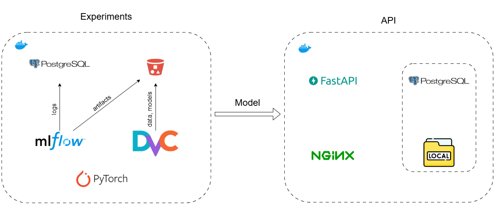

# Прогнозирование урожайности сельскохозяйственных культур

[Презентация](https://docs.google.com/presentation/d/1Dl5uEMK-Daj6zj1fPC_kZ2-sb6jKfKHt3Agddp8zwiM/edit?usp=sharing)

## Структура проекта

\* - данных нет в репозитории github и нужны только для отчетов.

```plaintext
├── app/                                        <- REST API приложение
│   
├── data/                                       <- Корневая директория для всех данных проекта
│   │
│   ├── external/                               <- Внешние данные, не изменяемые в рамках проекта (например, справочники)
│   │   │
│   │   └── state_and_county_fips_master.csv    <- Мастер-файл с кодами FIPS штатов и округов
│   │
│   ├── interim/                                <- Промежуточные данные, полученные в процессе обработки
│   │
│   ├── processed/                              <- Окончательные обработанные данные, готовые для обучения
│   │
│   └── raw/                                    <- Исходные сырые данные (не изменяются)
│       │
│       ├── ERA5-Land-Moisture/                 <- Данные о влажности почвы из ERA5-Land
│       │
│       ├── Sentinel/                           <- Данные спутника Sentinel
│       │
│       ├── USDA/                               <- Исторические данные об урожайности США
│       │
│       └── WRF-HRRR/                           <- Метеорологические данные модели WRF-HRRR
|
├── mlflow/                                     <- Директория для MLflow
│   │
│   ├── Dockerfile                              <- конфигурация Docker для развертывания MLflow-сервера
│   │
│   └── requirements.txt                        <- Зависимости Python для работы MLflow
|
├── postgres_mlflow_data                        <- PostgreSQL для хранения экспериментов (артефакты в S3)
│
├── notebooks/                                  <- Jupyter notebooks для анализа и визуализации
│   │
│   ├── 1.1-data-review-sentinel.ipynb          <- Обзор и предварительный анализ данных Sentinel
│   │
│   ├── 1.2-data-review-usda.ipynb              <- Обзор данных USDA
│   │
│   ├── 1.3-data-review-wrf-hrrr.ipynb          <- Анализ метеорологических данных
│   │
│   ├── 1.4-data-review-moisture.ipynb          <- Анализ данных о влажности почвы
│   │
│   └── 2.0-EDA.ipynb                           <- Notebook для разведочного анализа данных (EDA)
│
├── obsidian/                                   <- Заметки в формате Obsidian
│
├── resources/                                  <- * Ресурсы проекта (изображения, карты и т.д.)
│   │
│   ├── diagrams/                               <- Диаграммы (документация)
│   │
│   └── USA-map/                                <- Географические данные по США
│
├── src/                                        <- Исходный код проекта
│   │
│   ├── data/                                   <- Скрипты для работы с данными
│   │   │
│   │   ├── dataset.py                          <- torch Dataset
│   │   │
│   │   ├── download.py                         <- Скрипты для загрузки данных
│   │   │
│   │   ├── ERA5_nc_to_csv.ipynb                <- Конвертация данных ERA5 из netCDF в CSV
│   │   │
│   │   ├── integration.py                      <- Интеграция данных из разных источников
│   │   │
│   │   ├── process.py                          <- Предобработка данных после интеграции
│   │   │
│   │   └── README.md                           <- Описание пайплайна всей предобработки данных
|   |
│   ├── model/                                  <- Скрипты для работы с моделями
│   │   │
│   │   ├── models.py                           <- Модели машинного обучения
│   │   │
│   │   ├── run.py                              <- Запуск обучения
|   |   |
│   │   └── train.py                            <- Код для обучения, тестирования и трекинга моделей
│
├── .dvcignore                                  <- Файл исключений для DVC (аналог .gitignore)
│
├── .gitignore                                  <- Файл исключений для Git
│
├── data.dvc                                    <- Файл конфигурации DVC для управления данными
│
├── dvc.lock                                    <- Файл блокировки DVC (аналог package-lock.json)
│
├── dvc.yaml                                    <- Конфигурация pipelines DVC
│
├── README.md                                   <- Основная документация проекта
│
├── docker-compose.yaml                         <- docker-compose.yaml
|
├── requirements.txt                            <- Зависимости Python
│
└── .env                                        <- Переменные окружения (чувствительные данные)
```



## Постановка задачи

Прогнозирование урожайности *кукурузы* (бушель/акр) *региона* (в частности регионов штатов IL, IA, IN, KY, MO, OH) на основе данных периода с *Март-Август* включительно.

## Навигация по проекту

### 1. Описание данных

- [спутниковые снимки Sentinel](notebooks/1.1-data-review-sentinel.ipynb);
- [исторические данные об урожайности](notebooks/1.2-data-review-usda.ipynb);
- [климатические данные](notebooks/1.3-data-review-wrf-hrrr.ipynb);
- [данные о влажности почвы](notebooks/1.4-data-review-moisture.ipynb).

### 2. Интеграция данных

Соединение датасетов воедино

- [Интеграция данных](/src/data/integration.py).

### 3. Исследовательский анализ данных

Анализ данных, полученных после *интеграции*

- [EDA](notebooks/2.0-EDA.ipynb)

### 4. Предобработка данных

- [Data Processing](src/data/process.py)
- [torch Dataset](src/data/dataset.py)

### 5. Обучение и тестирование

- [Модели](src/model/models.py)
- [Обучение и тестирование моделей](src/model/train.py)

## Результаты экспериментов на момент baseline

- RNNRegressor


- MultiCNNGRU


- ResNetRegressor


- MultiModal


Результаты представлены в таблице

| Модель                  | Описание                                     | $R^2$ | $RMSE$ |
| ----------------------- | -------------------------------------------- | ----- | ------ |
| FlexibleResNetRegressor | 3×896×896 (15 августа)                       | 0.691 | 16.027 |
| EfficientNetRegressor   | 3x512x512 (15 август).                       | 0.652 | 17.039 |
| MultiCNNGRU             | 3×896×896 (июнь-август)                      | 0.657 | 16.899 |
| MultiCNNGRU             | 3x224x224 (март-август)                      | 0.637 | 17.389 |
| MultiModal              | 3×224×224 (март-август) + климатические      | 0.633 | 17.490 |
| EfficientNetB4Regressor | 3×896×896 (15 августа)                       | 0.630 | 17.560 |
| ResNetRegressor         | 3x224x224 (15 августа)                       | 0.618 | 17.849 |
| RNNRegressor            | Климатические табличные данные (март-август) | 0.135 | 26.857 |

## Выводы

- Чем ближе к сбору данные, тем лучше они объясняют таргетную переменную (логично, но все же);
- климатические данные и модель RNNRegressor плохо объясняют таргетную переменную, но есть результаты;
- чем сильнее мы обрезаем изображение, тем меньше качество;
- учет динамики изменений изображений тоже несут полезную информацию, т.к. MultiCNNGRU показывает лучшее качество, чем ResNetRegressor (в основе обоих стоит resnet18);
